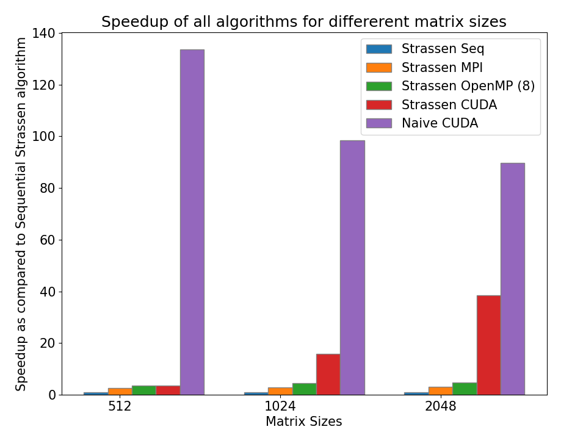

# Parallelizing Strassen’s Matrix Multiplication

## Overview
Matrix Multiplication is possibly one of the most important matrix operations and is actively employed in multiple scientific and engineering applications. But the main problem faced during computing the product of matrices is that matrix multiplication is a computationally intensive algorithm. The worst time complexity of the traditional or naive Matrix Multiplication algorithm is O(n^3) due to which this algorithm is not suitable for larger sizes of matrices. Strassen's Matrix Multiplication Algorithm is a newer and interesting approach to compute the product of matrices and manages to reduce the worst time complexity. Strassen's Matrix Multiplication Algorithm uses a Divide and Conquer approach to bring down the time complexity to approximately O(n^2.81). But this approach has its own shortcomings as this algorithm is potentially more memory intensive and has a larger constant factor which makes this algorithm unsuitable for multiplication of smaller matrices. This paper focuses on improving the execution time of matrix multiplication by using standard parallel computing practices to perform parallel matrix multiplication. OpenMP, MPI and CUDA are used to develop algorithms by combining the naive matrix multiplication algorithm and Strassen's matrix multiplication algorithm to create hybrid algorithms which allow parallel computation of matrix multiplication to give better results in the form of smaller execution time. The algorithms are written in C++ programming language and results produced by each of the parallel hybrid algorithms are analysed to decide which algorithm works the best.

# Project Structure
* sequential.cpp - CPP file for sequential naive and strassen matrix multiplication implementations  
* omp_strassen.cpp - CPP file for OpenMP strassen implementation  
* mpi_strassen.cpp - CPP file for MPI strassen implementation  
* cuda_naive.cpp - CPP file for CUDA naive implementation  
* cuda_strassen.cpp - CPP file for CUDA strassen implementation  
* cuda.ipynb - Executable IPYNB notebook containing the CUDA implementations for naive and strassen algorithms
* plot.png - Bar plot showing the speedup of different algorithms as compared to Sequential strassen algorithm for different sizes of matrix.

# Instructions
--> To execute the file 'sequential.cpp'  
> g++ sequential.cpp  
> ./a.out  

--> To execute the file 'omp_strassen.cpp'
> g++ -fopenmp omp_strassen.cpp  
> ./a.out  

--> To execute the file 'mpi_strassen.cpp'
> mpicxx mpi_strassen.cpp  
> mpiexec -n 8 ./a.out

--> The files 'cuda_naive.cpp' and 'cuda_strassen.cpp' are unexecutable files. The code in the files has to be loaded in a colab notebook as it requires a GPU environment. The file 'cuda.ipynb' contains the combined code of both the files. Follow the following steps to run the notebook:
- Upload the notebook on Google Colab
- Change the runtime of the colaboaroty to GPU
- Execute each cell of the notebook sequentially. 
- The size of the matrix in multiplication is hardcoded to 512 as Colab does not allow input from user. Change the size from the code itself if needed.

--> The plot comparing the speedup of different algorithms as compared to Sequential strassen algorithm for different sizes of matrix:

## Purpose  

The project 'Parallelizing Strassen’s Matrix Multiplication' has been created as a mini project for the course IT301- Parallel Computing.  

## Contributors  

- Pratham Nayak (191IT241)  
- Aprameya Dash (191IT209)  
- Suyash Chintawar (191IT109) 
